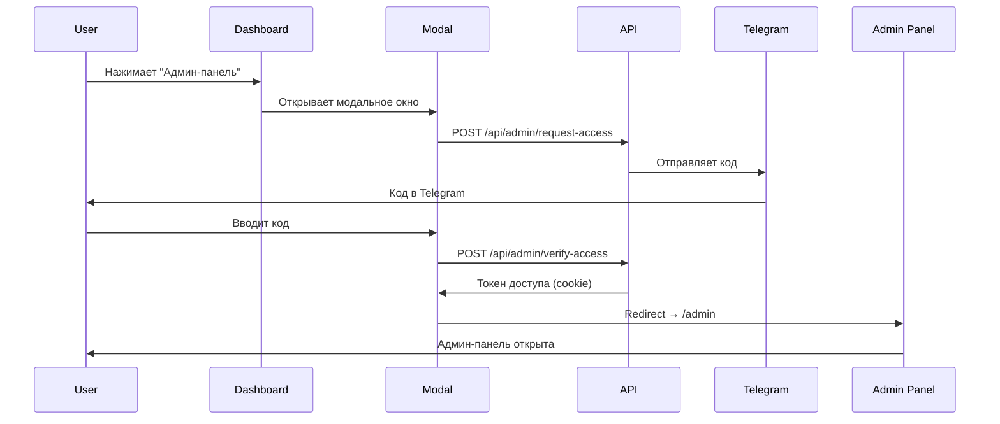

# FamilyPay - Система двухфакторной аутентификации для админ-панели

## 🔐 Новая функция: 2FA через Telegram

Теперь доступ к админ-панели защищен двухфакторной аутентификацией через Telegram бот!

### ✨ Особенности

- ✅ **Автоматическая отправка кода** в Telegram при попытке входа в админ-панель
- ✅ **6-значный код** с ограниченным сроком действия (5 минут)
- ✅ **Контроль доступа по email** — только указанные администраторы
- ✅ **Обязательная верификация** при каждом входе
- ✅ **Раздельный выход** — можно выйти из админки, не выходя из аккаунта
- ✅ **Красивый UI** — модальное окно с таймером и автофокусом

### 📸 Как это работает

1. **Войдите в свой аккаунт** с email администратора
2. **На Dashboard** справа вверху появится кнопка "🔐 Админ-панель"
3. **Нажмите на кнопку** — откроется модальное окно
4. **Код отправится в Telegram** автоматически
5. **Введите код** в форму
6. **Готово!** Вы в админ-панели

### 🎯 Для кого

Кнопка "🔐 Админ-панель" **видна только администраторам**, чей email указан в конфигурации:

```typescript
// lib/admin-config.ts
export const ADMIN_EMAILS = [
  'aliaratatatev@gmail.com',
  // Добавьте другие email администраторов
];
```

Обычные пользователи **не видят эту кнопку**.

## 🚀 Быстрый старт

### 1. Настройка Telegram

#### Создайте бота
```
1. Откройте @BotFather в Telegram
2. Отправьте: /newbot
3. Следуйте инструкциям
4. Сохраните токен
```

#### Получите Chat ID
```bash
# Способ 1: Скрипт
node scripts/get-telegram-chat-id.js

# Способ 2: Вручную
# Отправьте боту сообщение, затем откройте:
https://api.telegram.org/bot<ТОКЕН>/getUpdates
```

### 2. Настройте .env

```env
TELEGRAM_BOT_TOKEN="ваш-токен-от-BotFather"
TELEGRAM_CHAT_ID="ваш-chat-id"
```

### 3. Добавьте администраторов

Отредактируйте два файла:

**lib/admin-config.ts:**
```typescript
export const ADMIN_EMAILS = [
  'aliaratatatev@gmail.com',
  'your-email@gmail.com',  // ← Ваш email
];
```

**middleware.ts:**
```typescript
const ADMIN_EMAILS = [
  'aliaratatatev@gmail.com',
  'your-email@gmail.com',  // ← Ваш email
];
```

### 4. Запустите проект

```bash
npm run dev
```

### 5. Войдите в админ-панель

1. Войдите в аккаунт с email администратора
2. На Dashboard нажмите "🔐 Админ-панель"
3. Введите код из Telegram
4. 🎉 Вы в админ-панели!

## 📁 Структура файлов

```
lib/
├── admin-config.ts          # Конфигурация администраторов
└── telegram.ts              # Интеграция с Telegram Bot API

app/
├── api/admin/
│   ├── request-access/      # API: запрос кода
│   ├── verify-access/       # API: проверка кода
│   ├── check-access/        # API: проверка доступа
│   └── logout-admin/        # API: выход из админки
└── components/
    └── AdminAccessModal.tsx # Модальное окно ввода кода

middleware.ts                # Защита /admin/* routes

scripts/
└── get-telegram-chat-id.js  # Утилита для получения Chat ID
```

## 🔒 Безопасность

- **Email whitelist** — доступ только для указанных email
- **Временные коды** — код действителен 5 минут
- **Одноразовые коды** — каждый код используется один раз
- **HttpOnly cookies** — защита от XSS атак
- **Middleware защита** — проверка на уровне Next.js
- **Обязательная 2FA** — код требуется при каждом входе

## 📝 API Endpoints

| Endpoint | Метод | Описание |
|----------|-------|----------|
| `/api/admin/request-access` | POST | Запрос кода (отправка в Telegram) |
| `/api/admin/verify-access` | POST | Проверка кода |
| `/api/admin/check-access` | GET | Проверка текущего доступа |
| `/api/admin/logout-admin` | POST | Выход из админ-панели |

## 🎨 UI/UX

### Dashboard
```
┌─────────────────────────────────────────────────────────┐
│  FamilyPay                 🔐 Админ-панель  Выйти      │
│                            ↑                            │
│                      Видно только админам               │
└─────────────────────────────────────────────────────────┘
```

### Модальное окно
```
┌───────────────────────────────┐
│           🔐                  │
│   Вход в админ-панель         │
│                               │
│   ┌─────────────────────┐    │
│   │     0 0 0 0 0 0     │    │ ← 6-значный код
│   └─────────────────────┘    │
│                               │
│   ⏰ Код действителен: 4:32   │ ← Таймер
│                               │
│   [ Подтвердить ]             │
│                               │
│   Отправить новый код         │
└───────────────────────────────┘
```

### Админ-панель (левое меню)
```
┌──────────────────┐
│   FamilyPay      │
│   Админ-панель   │
│                  │
│ 📊 Dashboard     │
│ 👥 Пользователи  │
│ ...              │
│                  │
│ ┌──────────────┐ │
│ │ Admin User   │ │
│ │              │ │
│ │ 🚪 Выйти из  │ │ ← Выход из админки
│ │    админки   │ │
│ │ Выйти        │ │ ← Полный выход
│ └──────────────┘ │
└──────────────────┘
```

## 🐛 Troubleshooting

| Проблема | Решение |
|----------|---------|
| Код не приходит | Проверьте TELEGRAM_BOT_TOKEN и TELEGRAM_CHAT_ID |
| "Access denied" | Убедитесь, что email в ADMIN_EMAILS |
| "Invalid code" | Код истек (5 мин) — запросите новый |
| Redirect на /dashboard | Токен доступа отсутствует — пройдите верификацию |
| Кнопка не видна | Ваш email не в ADMIN_EMAILS |

## 📚 Документация

- **[QUICK_START_ADMIN.md](./QUICK_START_ADMIN.md)** — Краткая инструкция
- **[ADMIN_ACCESS.md](./ADMIN_ACCESS.md)** — Полная документация
- **[.env.example](./.env.example)** — Пример конфигурации

## 🎯 Workflow



## 🔧 Настройки

### Изменить время действия кода

```typescript
// lib/admin-config.ts
export const VERIFICATION_CODE_EXPIRY = 5 * 60 * 1000; // мс
```

### Добавить администратора

Добавьте email в `ADMIN_EMAILS` в двух файлах:
1. `lib/admin-config.ts`
2. `middleware.ts`

### Изменить формат кода

```typescript
// lib/telegram.ts
export function generateVerificationCode(): string {
  return Math.floor(100000 + Math.random() * 900000).toString();
  //     ^^^^^^ 6-значный код
}
```

## 🚀 Production

Для production рекомендуется:

1. **Redis** для хранения кодов (вместо in-memory)
2. **Rate limiting** для защиты от brute-force
3. **HTTPS** обязательно для secure cookies
4. **Логирование** всех попыток доступа
5. **Мониторинг** подозрительной активности

## 📞 Поддержка

- Email администратора: aliaratatatev@gmail.com
- Telegram: @your_username (если есть)

## 📄 Лицензия

MIT

---

**Создано с ❤️ для безопасности вашей админ-панели**
