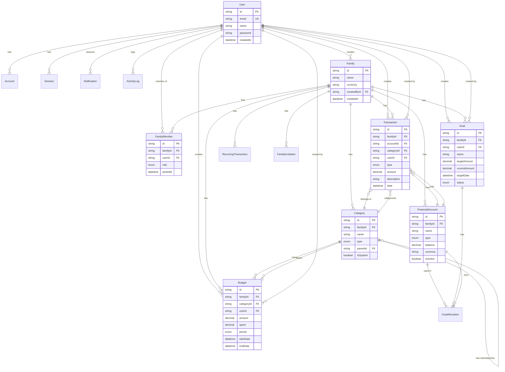
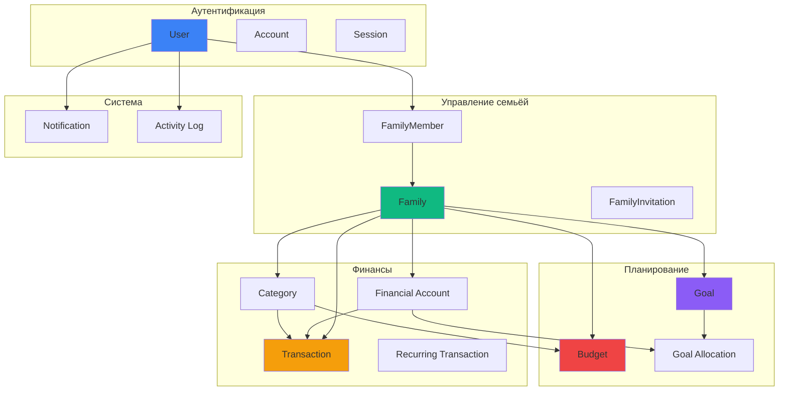

# Схема базы данных FamilyPay

## Обзор архитектуры

Схема БД построена на PostgreSQL с использованием Prisma ORM и включает следующие основные модули:

1. **Аутентификация и пользователи**
2. **Управление семьёй**
3. **Финансовые счета**
4. **Категории доходов/расходов**
5. **Транзакции**
6. **Бюджеты**
7. **Финансовые цели**
8. **Уведомления**
9. **Журнал активности**

---

## 1. Модуль аутентификации и пользователей

### User (Пользователь)
Основная таблица пользователей с поддержкой NextAuth.js

**Поля:**
- `id` - уникальный идентификатор (CUID)
- `email` - email (уникальный)
- `emailVerified` - дата подтверждения email
- `name` - имя пользователя
- `phone` - телефон
- `image` - аватар
- `password` - хешированный пароль
- `createdAt`, `updatedAt` - временные метки

**Связи:**
- Может иметь множество аккаунтов OAuth (Account)
- Может иметь множество сессий (Session)
- Может быть членом нескольких семей (FamilyMember)
- Создаёт транзакции, бюджеты, цели

### Account
OAuth аккаунты для социальной авторизации

### Session
Активные сессии пользователей

### VerificationToken
Токены подтверждения email

---

## 2. Модуль управления семьёй

### Family (Семья)
Основная единица для группировки финансов

**Поля:**
- `id` - уникальный идентификатор
- `name` - название семьи
- `currency` - валюта по умолчанию (RUB)
- `createdById` - создатель семьи
- `createdAt`, `updatedAt`

**Связи:**
- Имеет множество членов (FamilyMember)
- Имеет множество финансовых счетов
- Имеет все транзакции, бюджеты, цели

### FamilyMember (Член семьи)
Связь между пользователем и семьёй с ролями

**Роли (MemberRole):**
- `ADMIN` - полный доступ к управлению семьёй
- `PARENT` - управление финансами (создание бюджетов, целей)
- `TEEN` - ограниченный доступ (просмотр + свои транзакции)
- `VIEWER` - только просмотр

### FamilyInvitation
Приглашения новых членов в семью

---

## 3. Финансовые счета

### FinancialAccount (Финансовый счёт)
Счета для учёта денег

**Типы счетов (AccountType):**
- `CASH` - наличные
- `BANK_ACCOUNT` - банковский счет
- `CARD` - банковская карта
- `SAVINGS` - накопления
- `INVESTMENT` - инвестиции
- `DEBT` - долги/кредиты

**Поля:**
- `balance` - текущий баланс (Decimal 12,2)
- `currency` - валюта счёта
- `color`, `icon` - для визуализации в UI
- `isActive` - активность счёта

---

## 4. Категории

### Category (Категория)
Категории для классификации доходов и расходов

**Типы (CategoryType):**
- `INCOME` - доход
- `EXPENSE` - расход

**Особенности:**
- Поддержка подкатегорий (parentId)
- Системные категории (isSystem = true) нельзя удалить
- Могут быть глобальными (familyId = null) или семейными

**Примеры категорий:**
- Расходы: Продукты, Транспорт, ЖКХ, Развлечения, Здоровье
- Доходы: Зарплата, Фриланс, Инвестиции, Подарки

---

## 5. Транзакции

### Transaction (Транзакция)
Основная таблица для учёта всех денежных операций

**Типы (TransactionType):**
- `INCOME` - доход
- `EXPENSE` - расход
- `TRANSFER` - перевод между счетами

**Поля:**
- `amount` - сумма (Decimal 12,2)
- `date` - дата транзакции
- `description` - описание
- `location` - место покупки/геолокация
- `receipt` - ссылка на чек
- `tags` - массив тегов для фильтрации
- `toAccountId` - счёт назначения (для переводов)

**Индексы:**
- По familyId + date (для быстрой выборки по периодам)
- По accountId, categoryId, userId

### RecurringTransaction (Повторяющиеся транзакции)
Шаблоны для автоматического создания регулярных операций

**Частота (RecurrenceFrequency):**
- `DAILY` - ежедневно
- `WEEKLY` - еженедельно
- `BIWEEKLY` - раз в две недели
- `MONTHLY` - ежемесячно
- `QUARTERLY` - ежеквартально
- `YEARLY` - ежегодно

**Поля:**
- `startDate`, `endDate` - период действия
- `nextDate` - дата следующего выполнения
- `isActive` - активность правила

**Примеры использования:**
- Зарплата (MONTHLY)
- Коммунальные платежи (MONTHLY)
- Страховка (YEARLY)
- Подписки (MONTHLY)

---

## 6. Бюджеты

### Budget (Бюджет)
Планирование расходов по категориям

**Периоды (BudgetPeriod):**
- `WEEKLY` - недельный
- `MONTHLY` - месячный
- `QUARTERLY` - квартальный
- `YEARLY` - годовой

**Поля:**
- `amount` - лимит бюджета
- `spent` - уже потрачено (обновляется автоматически)
- `startDate`, `endDate` - период действия
- `alertAt50`, `alertAt80`, `alertAt100` - настройки уведомлений

**Логика работы:**
1. Создаётся бюджет на категорию с лимитом
2. При создании транзакции обновляется поле `spent`
3. При достижении порогов (50%, 80%, 100%) отправляются уведомления

---

## 7. Финансовые цели

### Goal (Финансовая цель)
Накопление на крупные покупки или события

**Статусы (GoalStatus):**
- `ACTIVE` - активная цель
- `COMPLETED` - достигнута
- `CANCELLED` - отменена
- `PAUSED` - приостановлена

**Поля:**
- `targetAmount` - целевая сумма
- `currentAmount` - текущая накопленная сумма
- `targetDate` - желаемая дата достижения
- `color`, `icon` - визуализация

### GoalAllocation (Пополнение цели)
История пополнений цели со счетов

**Поля:**
- `amount` - сумма пополнения
- `accountId` - с какого счёта
- `date` - дата пополнения
- `note` - комментарий

**Примеры целей:**
- Отпуск
- Новый автомобиль
- Ремонт квартиры
- Образование детей
- Резервный фонд

---

## 8. Уведомления

### Notification (Уведомление)
Система уведомлений для пользователей

**Типы (NotificationType):**
- `BUDGET_ALERT` - превышение бюджета
- `GOAL_MILESTONE` - прогресс по цели (например, достигнуто 50%)
- `RECURRING_DUE` - подошла дата повторяющейся транзакции
- `LOW_BALANCE` - низкий баланс на счёте
- `LARGE_EXPENSE` - подозрительно большая трата
- `FAMILY_INVITE` - приглашение в семью
- `SYSTEM` - системные уведомления

**Поля:**
- `title`, `message` - текст уведомления
- `data` - JSON с дополнительными данными
- `isRead` - прочитано ли

---

## 9. Журнал активности

### ActivityLog (Журнал действий)
История всех действий пользователей для аудита

**Действия (ActivityAction):**
- `CREATE` - создание
- `UPDATE` - изменение
- `DELETE` - удаление
- `INVITE` - приглашение
- `JOIN` - присоединение к семье
- `LEAVE` - выход из семьи

**Поля:**
- `entityType` - тип сущности (Transaction, Budget, Goal и т.д.)
- `entityId` - ID сущности
- `description` - описание действия
- `metadata` - JSON с дополнительной информацией

---

## Индексы и оптимизация

Созданы следующие индексы для оптимизации запросов:

1. **Transaction:**
   - `(familyId, date)` - для выборки транзакций семьи по периодам
   - `(accountId)` - для истории счёта
   - `(categoryId)` - для отчётов по категориям
   - `(userId)` - для персональной истории

2. **Budget:**
   - `(familyId, startDate, endDate)` - для активных бюджетов

3. **Goal:**
   - `(familyId, status)` - для списка целей

4. **Notification:**
   - `(userId, isRead)` - для непрочитанных уведомлений

5. **ActivityLog:**
   - `(userId, createdAt)` - для истории действий

6. **RecurringTransaction:**
   - `(familyId, nextDate)` - для обработки предстоящих транзакций

---

## Типы данных

### Decimal
Для денежных сумм используется `Decimal(12, 2)`:
- 12 цифр всего
- 2 цифры после запятой
- Максимум: 9,999,999,999.99

### Валюты
По умолчанию используется `RUB` (российский рубль), но система поддерживает мультивалютность.

### Даты
Все даты хранятся с временной зоной (DateTime).

---

## Безопасность и конфиденциальность

1. **Изоляция данных:** Все данные привязаны к семье (familyId)
2. **Каскадное удаление:** При удалении семьи удаляются все связанные данные
3. **Роли и права:** Система ролей ограничивает доступ к данным
4. **Аудит:** Все действия логируются в ActivityLog
5. **Хеширование паролей:** Пароли хранятся в хешированном виде

---

## Миграции

Для применения схемы выполните:

```bash
# Создание миграции
npx prisma migrate dev --name init

# Генерация Prisma Client
npx prisma generate

# Открыть Prisma Studio для просмотра данных
npx prisma studio
```

---

## Расширяемость

Схема спроектирована с учётом будущих расширений:

1. **Мультивалютность** - поддержка разных валют
2. **Теги** - гибкая система тегирования транзакций
3. **JSON поля** - для хранения метаданных без изменения схемы
4. **Подкатегории** - иерархическая структура категорий
5. **Переводы между счетами** - встроенная поддержка

---

## Примеры использования

### Создание семьи и добавление члена

```typescript
const family = await prisma.family.create({
  data: {
    name: "Семья Ивановых",
    currency: "RUB",
    createdById: userId,
    members: {
      create: {
        userId: userId,
        role: "ADMIN"
      }
    }
  }
});
```

### Создание транзакции

```typescript
const transaction = await prisma.transaction.create({
  data: {
    familyId: familyId,
    accountId: accountId,
    categoryId: categoryId,
    userId: userId,
    type: "EXPENSE",
    amount: 1500.50,
    description: "Продукты в Пятёрочке",
    date: new Date()
  }
});
```

### Создание бюджета

```typescript
const budget = await prisma.budget.create({
  data: {
    familyId: familyId,
    categoryId: categoryId,
    userId: userId,
    name: "Продукты на месяц",
    amount: 30000,
    period: "MONTHLY",
    startDate: new Date("2026-09-01"),
    endDate: new Date("2026-09-30")
  }
});
```

### Создание финансовой цели

```typescript
const goal = await prisma.goal.create({
  data: {
    familyId: familyId,
    userId: userId,
    name: "Отпуск в Турции",
    description: "Семейный отдых летом 2027",
    targetAmount: 300000,
    targetDate: new Date("2027-07-01"),
    status: "ACTIVE"
  }
});
```

---

## Заключение

Эта схема обеспечивает:
- ✅ Полный контроль семейных финансов
- ✅ Гибкую систему категорий и счетов
- ✅ Планирование через бюджеты и цели
- ✅ Автоматизацию повторяющихся операций
- ✅ Систему ролей и безопасность данных
- ✅ Детальный аудит всех действий
- ✅ Уведомления о важных событиях


---

## Диаграмма связей (ER-диаграмма)



---

## Визуализация модулей


